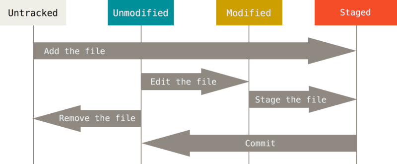

## 2.1 Git의 기초 - Git 저장소 만들기
### Git 저장소 만들기
#### 기존 디렉토리를 Git 저장소로 만들기
$ git init
Initialized empty Git repository in D:/project/study/studyGit/.git/

이 명령은 .git 이라는 하위 디렉토리를 만든다. .git 디렉토리에는 저장소에 필요한 뼈대 파일(Skeleton)이 들어 있다. 이 명령만으로는 
아직 프로젝트의 어떤 파일도 관리하지 않는다. (.git 디렉토리가 막 만들어진 직후에 정확히 어떤 파일이 있는지에 대한 내용은 Git의 내부에서 다룬다)

#### 기존 저장소를 Clone 하기
$ git clone https://github.com/roadseeker/redmine_manual.git
```
Cloning into 'redmine_manual'...
remote: Enumerating objects: 27, done.
remote: Counting objects: 100% (27/27), done.
remote: Compressing objects: 100% (10/10), done.
remote: Total 27 (delta 6), reused 27 (delta 6), pack-reused 0
Receiving objects: 100% (27/27), 6.66 KiB | 1.66 MiB/s, done.
Resolving deltas: 100% (6/6), done.
```
다른 프로젝트에 참여하려거나(Contribute) Git 저장소를 복사하고 싶을 때 git clone 명령을 사용한다. 
이미 Subversion 같은 VCS에 익숙한 사용자에게는 "checkout" 이 아니라 "clone" 이라는 점이 도드라져 보일 것이다. 
Git이 Subversion과 다른 가장 큰 차이점은 서버에 있는 거의 모든 데이터를 복사한다는 것이다. 
git clone 을 실행하면 프로젝트 히스토리를 전부 받아온다.

## 2.2 Git의 기초 - 수정하고 저장소에 저장히기
### 수정하고 저장소에 저장하기
워킹 디렉토리의 모든 파일은 크게 Tracked(관리대상임)와 Untracked(관리대상이 아님)로 나눈다.
Tracked 파일은 이미 스냅샷에 포함돼 있던 파일이다. Tracked 파일은 또 Unmodified(수정하지 않음)와 Modified(수정함) 그리고 Staged(커밋으로 저장소에 기록할) 상태 중 하나이다. 



### 파일 상태 확인하기
파일의 상태를 확인하려면 보통 git status 명령을 사용한다. Clone 한 후에 바로 이 명령을 실행하면 아래과 같은 메시지를 볼 수 있다.

```
$ git status
On branch master

No commits yet

Untracked files:
  (use "git add <file>..." to include in what will be committed)
        chapter.10. Git Internals
        chapter1. Getting Started.md
        chapter2. Git Basics.md
        chapter3. Git Branching.md
        chapter4. Git on the Server.md
        chapter5. Distributed Git.md
        chapter6. GitHub.md
        chapter7. Git Tools.md
        chapter8. Customizing Git.md
        chapter9. Git and Other Systems.md
        images/

nothing added to commit but untracked files present (use "git add" to track)
```
$ echo "Git User Guide" > README.md
